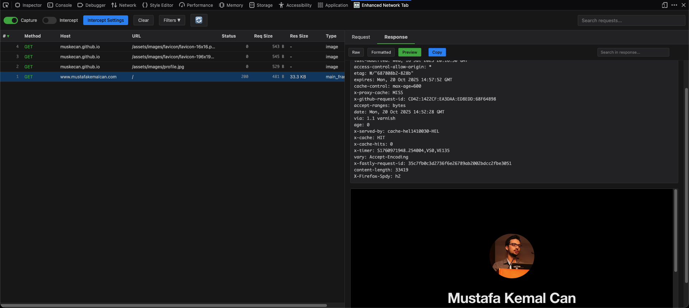
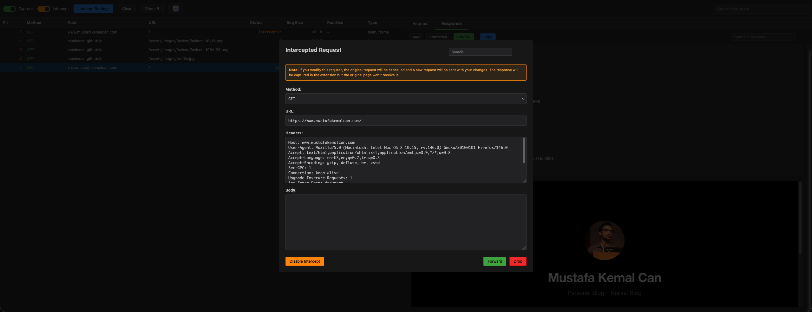

# Enhanced Network Tab

A lightweight Firefox extension for capturing, analyzing, and modifying HTTP/HTTPS requests in real-time.

[](https://addons.mozilla.org/en-US/firefox/addon/enhanced-network-tab/)

## Features

- **Request Capture**: Monitor all HTTP/HTTPS traffic from the active tab
- **Request Interception**: Intercept and modify requests before they are sent
- **Response Interception**: Intercept and modify responses before they reach the browser
- **Match & Replace**: Create rules to automatically modify request URL, headers, or body content
- **Security Scanner**: Automatically scan response bodies for sensitive data and security issues
- **Vulnerable JS Library Scanner**: Detect outdated JavaScript libraries with known CVEs (Thanks to Retire.js)
- **Request Repeater**: Resend requests with custom modifications for testing
- **Advanced Filtering**: Filter requests by method, URL patterns, and file types
- **Responsive UI**: Optimized layout that automatically adapts to vertical split views or narrower windows
- **Dark/Light Theme**: Automatic or manual theme switching
- **Export as cURL**: Copy any request (original or modified) as a cURL command
- **Decoder**: Built-in tool for encoding/decoding URL, Base64, Hex, HTML, and JWT
- **Column Sorting**: Sort and resize request table columns
- **Search**: Search through request/response headers and bodies
- **Highlighting Rules**: Color-code requests based on custom URL patterns

### Security Scanner (Beta)

The built-in security scanner automatically analyzes response bodies while you browse, detecting potential security issues. **This feature is currently in beta.**

**Supported API Key Patterns (100+ patterns):**

| Service | Detected Token Types |
|---------|---------------------|
| **AWS** | Access Key ID, Secret Key |
| **Google Cloud** | API Key, OAuth Access Token |
| **GitHub** | Classic PAT, Fine-Grained PAT, OAuth, User-to-Server, Server-to-Server, Refresh Token |
| **OpenAI** | User API Key, Project Key, Service Key (with T3BlbkFJ marker) |
| **Stripe** | Live/Test Secret Key, Restricted Key, Publishable Key |
| **Slack** | Bot Token, User Token, Config Token, Refresh Token, Webhook |
| **Facebook** | Access Token, OAuth 2.0 |
| **Square** | Access Token, OAuth Secret |
| **PayPal/Braintree** | Access Token |
| **Twilio** | API Key |
| **SendGrid** | API Key |
| **Mailgun** | API Key |
| **MailChimp** | Access Token |
| **WakaTime** | API Key |
| **Amazon MWS** | Auth Token |
| **Foursquare** | Secret Key |
| **Picatic** | API Key |
| **GitLab** | Personal Access Token |
| **Anthropic** | API Key |
| **HuggingFace** | API Token |
| **Replicate** | API Token |
| **DigitalOcean** | Personal Access Token |
| **Notion** | Integration Token |
| **Azure** | Storage Connection String |
| **Firebase** | Cloud Messaging Token |
| **Dropbox** | Access Token |
| **Cloudflare** | API Token |
| **Terraform** | Token |

**Other Detection Categories:**
- **Credentials**: Hardcoded passwords, usernames, database credentials, connection strings
- **JWT Tokens**: JSON Web Tokens with validation
- **Private Keys**: RSA, DSA, EC, OpenSSH, PGP private keys
- **Basic Auth**: Credentials embedded in URLs
- **Generic Secrets**: API keys, access tokens, client secrets in variable assignments
- **Emails**: Email addresses found in JavaScript code
- **API Endpoints**: Hardcoded fetch/axios/XHR URLs and API base configurations
- **Sensitive Files**: Environment files (.env), SSH keys, Git exposure, backup files

**Database Connection URLs:**
- **MongoDB**: Connection URLs with embedded credentials (`mongodb://`, `mongodb+srv://`)
- **PostgreSQL**: Connection URLs (`postgres://`, `postgresql://`)
- **MySQL**: Connection URLs (`mysql://`)
- **Redis**: Connection URLs (`redis://`)
- **RabbitMQ**: Connection URLs (`amqp://`)

**Features:**
- Background scanning even when DevTools is closed (with Capture enabled)
- Real-time scanning with badge notification on extension icon
- iOS-style notification badge showing unseen findings count
- Filterable by category and severity (Critical, High, Medium, Low, Info)
- Per-request Security tab showing findings for selected request
- Export findings as JSON for further analysis
- False positive filtering for placeholder values
- JSON and config file format support

### Vulnerable JavaScript Library Scanner (Beta)

Automatically detects outdated JavaScript libraries with known security vulnerabilities, similar to [Retire.js](https://github.com/AleenCloud/retire.js).

**How It Works:**
- Scans JavaScript files loaded by websites
- Detects library versions via filename patterns, URL paths, and file content signatures
- Checks versions against a bundled vulnerability database (64+ libraries)
- Displays CVE identifiers, CWE categories, and severity ratings

**Supported Libraries Include:**
| Category | Libraries |
|----------|-----------|
| **DOM/UI** | jQuery, jQuery UI, jQuery Mobile, jQuery Migrate, Bootstrap, Angular, AngularJS, React, Vue.js, Ember.js, Backbone.js |
| **Utilities** | Lodash, Underscore.js, Moment.js, Handlebars, Mustache |
| **Editors** | TinyMCE, CKEditor, CodeMirror |
| **Media** | Video.js, jPlayer, Plyr |
| **Other** | D3.js, Chart.js, Socket.io, Three.js, Knockout, YUI, Prototype.js, Dojo, MooTools |

**Features:**
- Offline detection using bundled vulnerability database
- Merged findings for same library+version with multiple vulnerabilities
- Clickable CVE links to NVD database
- Severity-based filtering (Critical, High, Medium, Low)
- Detection method indicator (filename, URI, or file content)

## Screenshots

### Main Dashboard


### Request Interception


## Installation

### From Firefox Add-ons

**[Install directly from Firefox Add-ons →](https://addons.mozilla.org/en-US/firefox/addon/enhanced-network-tab/)**

Click the link above or search for "Enhanced Network Tab" in Firefox Add-ons.

### From Source

1. Clone or download this repository
2. Open Firefox and navigate to `about:debugging`
3. Click "This Firefox" in the left sidebar
4. Click "Load Temporary Add-on"
5. Navigate to the extension directory and select the `manifest.json` file

## Usage

1. Open Firefox Developer Tools (F12)
2. Navigate to the "Enhanced Network Tab" panel
3. Toggle "Capture" to start monitoring network traffic
4. Toggle "Intercept" to intercept and modify requests (optional)
5. Click on any request to view details
6. Use "Send to Repeater" to resend modified requests
7. Configure intercept rules via "Intercept Settings"
8. Click "Automated Scanner" button to view security findings (badge shows unseen count)


## Privacy & Security

**This extension is 100% privacy-focused and works completely offline:**

- No data is sent to any external servers
- No analytics, tracking, or telemetry
- All data stays in your browser
- Only uses local storage for UI preferences (theme, column widths)
- All network requests you see are made by YOU manually (via Repeater feature)

The extension only monitors and modifies network traffic you explicitly choose to intercept. No data leaves your machine.

## Browser Compatibility

- **Firefox**: Version 57+ (Quantum and later)
- **Chrome/Edge**: Not supported (uses Firefox-specific WebExtension APIs)

## Development

The extension is built using vanilla JavaScript with the Firefox WebExtensions API.

### File Structure

```
├── background/
│   └── background.js          # Background service worker
├── devtools/
│   ├── devtools.html          # DevTools panel entry point
│   ├── devtools.js            # DevTools panel initialization
│   ├── panel.html             # Main UI
│   ├── panel.js               # UI logic and event handlers
│   ├── panel.css              # Styles with theme support
│   └── security-scanner.js    # Security scanning module
├── icons/                     # Extension icons
├── jsrepository.json          # Vulnerable JS library database (Retire.js format)
└── manifest.json              # Extension manifest
```

## License

MIT License - see [LICENSE](LICENSE) file for details.

## Support

For bugs, feature requests, or questions, please open an issue on GitHub.

